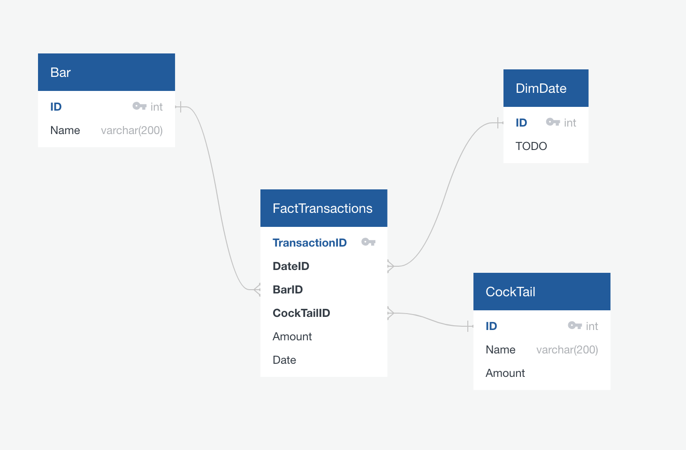
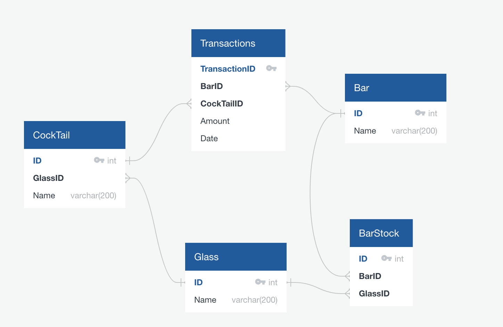

## Config.yaml
This file serves as the central configuration file for our pipeline. Within this file, we define essential parameters for configuring the data flow. It serves as  the blueprint for the data's journey, encompassing data source definitions and the specific transformations to be applied to them. Additionally, it holds parameters for our database and tables.

** Structure: **
The file comprises three main sections, each of which plays a pivotal role in orchestrating the data processing pipeline:

- API: Under this section, we define data sources from various APIs. It includes the specifications, parameters, and any custom configurations necessary to fetch data from these sources and process them into a pandas data frame.

- CSV: In this segment, we specify the data sources from CSV files. Similar to the API section, it holds parameters and custom configurations required for handling CSV data into a pandas data frame.

- Database: The database  name and specific tables needs to be defined in this section of the file. 

# Example parameters for DATABASE, CSV and API in the config file
```
DATABASE:
  transaction_table_stage:  str (required) transactions staging table
  stock_table_stage: str (required) stock staging table
  cocktail_table_stage: str (required) cocktail staging table
  glass_table_stage: str (required) glass staging table
  date_table:  str (optional) provide this only when initial_load is true
  initial_load:  bool (required) inidcates if this is an initial load.
```
```
API:
  glass:
    name: str(required) name of the data being retrieved
    request_obj:
      url:  str (required) endpont of the api
    data_field: str(required) the field holding the data from the API response
    columns_mapping: Dict[str](optional) name of columsn to rename
    capitalize_columns: List(str) columns to convert to title case.
    drop_columns: List(str) columns to drop from final output.
```
```
CSV:
  transactions:
    - name: str(required) name of the data being retrieved
      pandas_kwargs: Dict[str](required) arguments to pass to pandas read_csv
        filepath_or_buffer: str (required) csv file path
        parse_dates: List[int](optional) integer position of columns to parse as date 
        date_format: str(optional) only required if parse_dates is filled
        index_col: Int(optional) Integer position of column to use as index
      columns_mapping: Dict[str](optional) name of columsn to rename
      capitalize_columns: List(str) columns to convert to title case.
      drop_columns: List(str) columns to drop from final output.
```

## Test
This is where all the utility functions are tested to make sure they produce the expected results when they get the correct input. 


## Steps to run the pipeline
-  set Database connection Parameters as environment variables
```
export PG_USER=""
export PG_PASSWORD=""
export PG_HOST=""
export PG_PORT=""
export PG_DATABASE=""
```
- create a virtual environement and activate it (You must have python > 3.9 installed)
```
python -m venv etl
source etl/bin/activate
```
- install dependencies
```
pip install --upgrade pip
pip install -r requirements.txt
```
#### Create database tables
```
python utils/sql.py 
```
#### Run the pipeline
```
python main.py 
```

# Reporting Layer Data Model


# Relational Data Model



